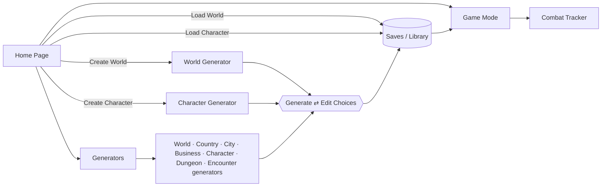

# Product Requirements Document: Dungeon Master Companion

| | |
|---|---|
| **Status** | Draft v0.1 |
| **Date** | 2026-09-26 |
| **Owner** | Product (TBD) |
| **Related** | [Technical Design Document](./TDD.md) · [Application flow diagram](./assets/app-flow-diagram.png) |

---

## 1. Overview

**Dungeon Master Companion** is an AI-powered prep and at-the-table tool for tabletop RPG Game Masters (GMs/DMs). It lets a DM quickly generate a whole world or any single piece of one (a country, a city, a shop, an NPC, a dungeon, an encounter), refine it through an edit-and-regenerate loop, save it into a connected campaign library, and then run it at the table from a fast, read-optimized **Game Mode** with a built-in **Combat Tracker**.

The product combines two kinds of generation:

- **Procedural generation** (seeded, deterministic) for structure and numbers: maps, terrain, population counts, race mixes, economies, dungeon layouts, encounter balance.
- **AI generation** (large language model) for names, descriptions, personalities, histories, rumors, plot hooks, and everything that has to read well.

### 1.1 Problem

DMs spend hours of prep per session creating content their players may never see, and they still get caught out when players do something unexpected ("We go into the blacksmith. What's her name?"). Today's options are:

- **Random tables and one-off generators.** They are fast but disconnected. A name generator doesn't know which town the NPC lives in, and nothing is saved in context.
- **Campaign wikis and notes apps.** They keep things organized, but the DM has to write every word.
- **General-purpose AI chat.** It writes well, but its output isn't structured, isn't saved into a navigable world, and drifts out of consistency over a campaign.

### 1.2 Solution

One tool that **generates, organizes, and runs** campaign content:

1. **Generate** any entity at any level of the world hierarchy. Every input is optional: fill in as much or as little as you like and the rest is chosen for you.
2. **Refine** the result by editing your choices and regenerating. Anything you like can be locked so it survives the next regeneration.
3. **Save** entities into a connected hierarchy: World → Country → City/Town/Village → Business, with Characters, Dungeons, and Encounters attached wherever they belong.
4. **Run** the session from Game Mode. Drill down from the world map to a tavern's owner in a few taps, launch an encounter straight into the combat tracker, and generate new content on the spot, already placed in its context.

---

## 2. Goals and Non-Goals

### 2.1 Goals

| # | Goal |
|---|---|
| G1 | Cut the time to prep a playable settlement (map, businesses, key NPCs, local dungeon) from hours to **under 5 minutes**. |
| G2 | Let a DM improvise at the table: a context-aware NPC, shop, or encounter in **under 15 seconds**. |
| G3 | Keep generated content **internally consistent**: names, geography, economy, and demographics agree across levels of the hierarchy. |
| G4 | Treat every generator as **usable standalone** (quick one-off) *and* **composable** (attached to a world). |
| G5 | Run combat at the table without a separate tool. |

### 2.2 Non-Goals (v1)

- A virtual tabletop (VTT) with tokens, fog of war, or player-facing live maps.
- Player accounts, player-facing character sheets, or a rules engine for player characters beyond what the Combat Tracker needs.
- Rule systems other than 5th-edition-compatible content (see Assumptions). The data model must not *prevent* other systems later.
- AI-generated raster art (portraits, illustrated maps). Maps are procedural vector maps in v1.
- A marketplace, or sharing content between users.

---

## 3. Target Users

| Persona | Description | Primary needs |
|---|---|---|
| **Prep-heavy Paula** | Runs a long homebrew campaign. Enjoys worldbuilding but is short on time. | Whole-world generation, a consistent hierarchy, deep editing, persistence. |
| **Improv Ian** | Runs loosely prepped sessions and reacts to players. | Fast in-context generation from Game Mode, a quick combat tracker. |
| **New-DM Nadia** | Running her first campaign and overwhelmed by prep. | Sensible defaults, all-optional inputs, one-click "just make me a town." |
| **One-shot Omar** | Runs convention games and one-shots. | Standalone dungeon and encounter generation, balanced encounters, printable output. |

---

## 4. Information Architecture

The flow diagram ([`assets/app-flow-diagram.png`](./assets/app-flow-diagram.png)) defines five areas:



### 4.1 Entity hierarchy

```
World
 └─ Country (1..n)
     ├─ City / Town / Village (1..n)
     │   ├─ Business (0..n)
     │   ├─ Character (0..n)   ← residents, business owners, notable NPCs
     │   └─ Dungeon (0..n)     ← nearby dungeons
     └─ Dungeon (0..n)         ← wilderness dungeons
Dungeon
 └─ Encounter (0..n)
Encounter ──▶ Combat Tracker (runtime session)
```

Every entity can also exist **unattached** (for example, a standalone NPC or a one-shot dungeon) and be attached to a parent later.

---

## 5. User Journeys

### J1: Build a world from scratch (Prep-heavy Paula)
1. Home → **Create World**.
2. She sets terrain to 40% forest, 20% mountains, 30% plains, 10% water; asks for 4 countries of mixed types; leaves everything else blank.
3. **Generate World and Map.** A world map appears with named countries, a capital per country, and a list of settlements and dungeons.
4. She dislikes one country's government. She changes that country's type in **Edit Choices**, locks the other three countries, and regenerates.
5. **Save.** The world, its countries, and its settlement stubs appear in World Saves. Each country and city is expanded to full detail when she opens it.

### J2: Quick town for tonight (New-DM Nadia)
1. Home → Generators → **City**.
2. She picks "Small Town" and leaves everything else blank → **Generate City and Map**.
3. She gets a town map, population and race mix, economy summary, 12 businesses with owners, notable NPCs, and one nearby dungeon hook.
4. **Save** as a standalone city. Later she attaches it to a country in her world.

### J3: Improvise at the table (Improv Ian)
1. Game Mode → World → Country → Town → Business List → "The Gilded Anvil".
2. The players ask about the smith's apprentice, who doesn't exist yet. He taps **+ Character (here)**. An apprentice is generated in context (race drawn from the town's mix, job fitted to the business, a personality) and saved in the business's staff list.
3. The players pick a fight. He opens **Encounters → Quick Encounter** (terrain and level pre-filled from the location) and launches it into the **Combat Tracker**.

### J4: Run a dungeon (One-shot Omar)
1. Generators → **Dungeon**: underground ruins, level 5, 8 rooms → **Generate Dungeon and Map**.
2. Each room has a description. Encounter rooms have balanced encounters created with the Encounter generator.
3. Game Mode → Dungeon List → Dungeon Details → Encounters → Encounter Details → **Combat Tracker**: roll monster initiative, enter player initiative, track damage.

---

## 6. Functional Requirements

Priority key: **P0** = required for MVP, **P1** = required for v1.0, **P2** = later.

### 6.1 Home Page

| ID | Requirement | Pri |
|---|---|---|
| HOME-1 | The Home Page offers: **Create World**, **Load World**, **Create Character**, **Load Character**, **Generators**, **Game Mode**. | P0 |
| HOME-2 | *Create World* opens the World Generator. *Create Character* opens the Character Generator. | P0 |
| HOME-3 | *Load World* opens World Saves. *Load Character* opens Character Saves. | P0 |
| HOME-4 | *Game Mode* opens Game Mode on the most recently used world, or asks the user to pick one. | P0 |
| HOME-5 | Shows recently edited entities for one-click resume. | P1 |

### 6.2 Generators: shared behavior

These requirements apply to all seven generators (World, Country, City, Business, Character, Dungeon, Encounter).

| ID | Requirement | Pri |
|---|---|---|
| GEN-1 | **All choices are optional.** Any input left blank is resolved automatically, using the parent context when there is one and sensible defaults otherwise. | P0 |
| GEN-2 | **Generate → Edit Choices → Generate loop.** After generating, the user can edit the choices and regenerate as many times as they want before saving. | P0 |
| GEN-3 | **Resolved choices are shown.** After generation, the Edit Choices panel shows the value the system picked for every input the user left blank, so the user can adjust it. | P0 |
| GEN-4 | **Locking.** The user can lock individual output fields or child entities (a name, a country, a business) so regeneration keeps them. | P1 |
| GEN-5 | **Partial regenerate.** Regenerate a single field or section (for example, "new personality", "new name", "reroll this room") without regenerating the whole entity. | P1 |
| GEN-6 | **Direct editing.** Every generated text and numeric field can be edited by hand before or after saving. | P0 |
| GEN-7 | **Seeded reproducibility.** Each generation records a seed. The same seed and choices reproduce the same procedural output (maps, numbers). AI text may vary. | P0 |
| GEN-8 | **Context awareness.** A generator started from inside a parent entity (for example, "new business in Riverbend") inherits the parent's context: race mix, economy, terrain, culture, level. | P0 |
| GEN-9 | **Progress feedback.** Generation that takes longer than 2 s shows streaming progress: partial text and a stage indicator ("Placing settlements…"). | P0 |
| GEN-10 | **Save** writes the entity, its choices, its seed, and any child entities to the matching Saves collection. | P0 |
| GEN-11 | **Discard/cancel** leaves no persisted data, apart from an optional unsaved-draft recovery. | P1 |
| GEN-12 | **"Surprise me"**: a one-click generate with every choice left blank. | P0 |
| GEN-13 | **Tone and content settings**: a campaign-level tone (grimdark, heroic, whimsical…) and content boundaries ("lines and veils") that all AI generation respects. | P1 |

### 6.3 World Generator

| Input (all optional) | Notes |
|---|---|
| Terrain percentages | Sliders for forest, grassland/plains, hills, mountains, desert, tundra, swamp, and water/ocean. Must total 100%; auto-normalized. |
| Amount of countries | 1–20. |
| Country type | Applies to all countries, or set per country (see §6.4 for the types). |
| Population / race mix percentage | World-level default mix, inherited by countries unless overridden. Must total 100%. |
| City / Town / Village totals | Target counts per settlement tier across the world. |
| Amount of dungeons | Total dungeons to seed across the world. |

**Output: "Generate World and Map"**
- A world map: landmasses, terrain biomes, rivers, country borders, settlement markers, dungeon markers.
- World name, overview, a brief history or era, major factions and religions (P1).
- A list of countries (name, type, capital, one-line summary), created as **stubs** that are expanded to full detail on demand (see TDD §6.5).
- Settlement and dungeon stubs, placed on the map.

| ID | Requirement | Pri |
|---|---|---|
| WG-1 | Generate a world map that honors terrain percentages within ±5 percentage points. | P0 |
| WG-2 | Generate N country regions with borders that follow geography where possible (rivers, mountain ridges). | P0 |
| WG-3 | Place settlements and dungeons in plausible locations (settlements near water and arable land; dungeons in remote or hostile terrain). | P0 |
| WG-4 | Country, settlement, and dungeon stubs can be expanded to full detail with one action. | P0 |
| WG-5 | World-level lore: overview, history, pantheon, and factions. | P1 |

### 6.4 Country Generator

| Input (all optional) | Notes |
|---|---|
| Country type | Kingdom, Empire, Republic, Theocracy, Magocracy, Tribal Confederation, City-State League, Oligarchy/Merchant Guild, Anarchy/Wildlands, Custom. |
| Population / race mix percentage | Defaults to the parent world's mix, varied slightly. |
| City / Town / Village size | Distribution or counts of settlement tiers. |
| Economy | Prosperity (Destitute → Opulent), primary industries, exports and imports, currency notes, tax level. |
| Amount of dungeons | Dungeons within the borders. |

**Output: "Generate Country and Map"**: a regional map; the government and ruler; capital; settlement list; economy profile; culture, laws, and customs; relations with neighbors (P1); dungeon list.

| ID | Requirement | Pri |
|---|---|---|
| CG-1 | Inside a world, the country map is a zoomed, more detailed region of the world map and stays consistent with it. | P0 |
| CG-2 | The country economy sets defaults for its settlements' economies and prices. | P0 |
| CG-3 | Standalone country generation produces its own regional map. | P0 |
| CG-4 | Diplomatic relations between sibling countries. | P1 |

### 6.5 City / Town / Village Generator

| Input (all optional) | Notes |
|---|---|
| Population / race mix percentage | Defaults to the parent country's mix. |
| City / Town / Village size | Tiers: Thorp, Hamlet, Village, Small Town, Large Town, Small City, Large City, Metropolis, each with a population range. |
| Economy | Prosperity plus primary industries. Defaults to the country's economy. |
| Business totals / type | Total count and/or counts by type (inn, tavern, blacksmith, general store, temple, alchemist…). |
| Amount of dungeons | Nearby dungeons. |

**Output: "Generate City and Map"**: a settlement map (districts, streets, landmarks, business locations); name; population and demographics; leadership and law; notable NPCs; a business list; rumors and plot hooks (P1); nearby dungeons.

| ID | Requirement | Pri |
|---|---|---|
| CT-1 | Population falls within the selected tier's range. Demographics match the race mix within ±2 percentage points (or exactly, for small populations, by rounding). | P0 |
| CT-2 | The number and types of businesses scale with size and economy when the user doesn't specify them (for example, a Hamlet has no bank). | P0 |
| CT-3 | Each business is generated with an owner Character. | P0 |
| CT-4 | Businesses appear on the settlement map. | P1 |
| CT-5 | Rumors and plot hooks that reference real saved entities (NPCs, dungeons). | P1 |

### 6.6 Business Generator

| Input (all optional) | Notes |
|---|---|
| Business type | Inn, Tavern, Blacksmith, Armorer, Fletcher, General Store, Alchemist, Magic Shop, Temple, Stable, Bank/Moneylender, Guild Hall, Library, Jeweler, Tailor, Custom. |
| Owner race | Defaults to a random draw from the settlement's race mix. |
| Business prosperity | Struggling, Modest, Comfortable, Wealthy, Opulent. Defaults to settlement prosperity ± variance. |

**Output: "Generate Business and Map"**: name; description and atmosphere; a floor plan; owner and staff (Characters); inventory or services with prices adjusted for the local economy; a secret or hook (P1).

| ID | Requirement | Pri |
|---|---|---|
| BG-1 | Prices are based on the ruleset's standard price list and adjusted by settlement economy and business prosperity. | P0 |
| BG-2 | Inventory fits the business type and prosperity (a struggling general store stocks fewer and cheaper goods). | P0 |
| BG-3 | A floor-plan map built from type-appropriate room templates. | P1 |

### 6.7 Character Generator

| Input (all optional) | Notes |
|---|---|
| Race | From the ruleset's species list plus custom. Defaults to a draw from the context's race mix. |
| Physical traits | Age, height/build, distinguishing features. |
| Personality traits | Traits, ideals, bonds, flaws, mannerisms, voice/speech notes. |
| Class / Job | An adventuring class (with level) or an occupation (blacksmith, guard, noble…). |

**Output: "Generate Character"**: name; a one-line summary; appearance; personality; background; motivations and secrets; relationships to other saved characters (P1); a stat block for combat-capable characters (P0 for classes; for occupations, a ruleset NPC stat-block template such as Guard, Noble, or Commoner).

| ID | Requirement | Pri |
|---|---|---|
| CH-1 | Names fit the race and culture, and are unique within their settlement. | P0 |
| CH-2 | Combat-capable characters have a stat block (AC, HP, initiative modifier, key attacks) that the Combat Tracker can use. | P0 |
| CH-3 | A "roleplay card" view: three bullet points and a voice note, for use at the table. | P1 |
| CH-4 | Relationship links (family, employer, rival) between characters. | P1 |

### 6.8 Dungeon Generator

| Input (all optional) | Notes |
|---|---|
| Terrain type | Underground, forest, mountain, swamp, desert, coastal, urban (sewers), planar. |
| Structures | Cave, ruins, crypt/tomb, fortress/keep, temple, mine, tower, lair, sewer. |
| Level | Target party level, 1–20. |
| Number of rooms | 1–50. |

**Output: "Generate Dungeon and Map"**: name; backstory and purpose; a grid map of rooms and corridors; a description per room (read-aloud text plus DM notes); traps, treasure, and hazards; encounters placed in rooms (created by the Encounter generator).

| ID | Requirement | Pri |
|---|---|---|
| DG-1 | The map has exactly the requested number of rooms, and every room is reachable. | P0 |
| DG-2 | Room contents fit the structure (a crypt has tombs, a mine has shafts). | P0 |
| DG-3 | Encounters are balanced for the dungeon level (see §6.9). | P0 |
| DG-4 | Treasure follows the ruleset's treasure guidance for the level. | P1 |

### 6.9 Encounter Generator

| Input (all optional) | Notes |
|---|---|
| Terrain type | As in the Dungeon generator, plus road, plains, arctic, and sea. |
| Structures | Where it happens: open field, ruins, bridge, cave, building interior… |
| Level | Party level, 1–20. *Party size* (default 4) and *difficulty* (Low / Moderate / High) are added as optional inputs. |
| Creature type | Aberration, Beast, Celestial, Construct, Dragon, Elemental, Fey, Fiend, Giant, Humanoid, Monstrosity, Ooze, Plant, Undead. |

**Output: "Generate Encounter"**: a creature list with counts and stat blocks; a difficulty rating; terrain and battlefield features; creature tactics; a setup description; treasure (P1).

| ID | Requirement | Pri |
|---|---|---|
| EN-1 | Creatures are chosen from the ruleset's monster list. Difficulty is computed with the ruleset's XP-budget rules and lands on the requested difficulty. | P0 |
| EN-2 | An encounter can be launched directly into the Combat Tracker. | P0 |
| EN-3 | An encounter can be attached to a dungeon room, a location, or saved standalone. | P0 |
| EN-4 | Custom and homebrew creatures (DM-entered stat blocks). | P1 |

> **Diagram note:** in the flow diagram, the *Encounter* item in the Generators menu has no connector drawn. This PRD assumes it opens the Encounter Generator, like the other menu items.

### 6.10 Saves (Library)

The diagram shows seven save collections: World, Country, City, Business, Character, Dungeon, and Encounter Saves. Saves are linked, so a World Save includes its countries, which include their cities, and so on.

| ID | Requirement | Pri |
|---|---|---|
| SV-1 | Each entity type has a browsable, searchable, filterable list (by world, parent, tag, and date). | P0 |
| SV-2 | Saving a parent saves all of its generated children. Loading a parent loads its children lazily. | P0 |
| SV-3 | Unattached entities can be **attached** to a compatible parent (a city to a country, a character to a business). Attached entities can be detached or moved. | P0 |
| SV-4 | Deleting a parent asks whether to delete its children or detach them. | P0 |
| SV-5 | Duplicate or "clone as template" any entity. | P1 |
| SV-6 | Version history: view and restore earlier saved versions of an entity. | P1 |
| SV-7 | Export a world, or any subtree, to JSON, Markdown, and PDF. Import from JSON. | P1 |
| SV-8 | Tags and free-text DM notes on any entity. | P0 |

### 6.11 Game Mode

Game Mode is the read-optimized, at-the-table view. It follows the drill-down in the diagram:

```
Game Mode
 ├─ World Details ─▶ Map · Country List · Country Details
 │    └─ Country Details ─▶ Map · City/Town/Village List · Country Details · Dungeon List
 │         └─ City/Town/Village Details ─▶ Map · Business List · Character List · Dungeon List
 │              └─ Business Details ─▶ Map · Business Details
 ├─ Character List ─▶ Character ─▶ Character Details ─▶ (add to) Combat Tracker
 ├─ Dungeon List ─▶ Dungeon Details ─▶ Encounters ─▶ Encounter Details ─▶ Combat Tracker
 └─ Encounter List ─▶ Encounters ─▶ Encounter Details ─▶ Combat Tracker
```

| ID | Requirement | Pri |
|---|---|---|
| GM-1 | Drill-down navigation as above, with breadcrumbs and back navigation. Any list item opens its details in ≤ 1 tap/click. | P0 |
| GM-2 | Interactive maps at every level. Clicking a map marker opens that entity. | P0 |
| GM-3 | Global quick search (Ctrl/Cmd-K) across every entity in the active world. | P0 |
| GM-4 | **In-context quick generate**: from any details page, generate a child (NPC, business, encounter) that inherits context and is saved automatically. | P0 |
| GM-5 | Character Details can add the character to the active Combat Tracker. | P0 |
| GM-6 | Encounter Details can start a Combat Tracker session with all of the encounter's creatures. | P0 |
| GM-7 | A session notes pad, pinned for the whole session and optionally linked to entities. | P1 |
| GM-8 | **Ask the World** (AI Q&A grounded in saved data, e.g. "Who in Riverbend would sell poison?"). Answers cite the entities they draw on. | P1 |
| GM-9 | Tablet-friendly layout, usable at 768 px width and up. | P0 |
| GM-10 | Offline read-only access to the active world. | P2 |
| GM-11 | Editing in Game Mode is limited to quick edits (notes, HP, flags). Full editing opens the generator or editor. | P0 |

### 6.12 Combat Tracker

| ID | Requirement | Pri |
|---|---|---|
| CB-1 | **Character initiative**: enter initiative manually for player characters, or roll it for NPCs. | P0 |
| CB-2 | **Creature initiative**: roll automatically (d20 + initiative modifier) for every creature, individually or grouped by creature type. | P0 |
| CB-3 | A sorted turn order with the current turn highlighted, next/previous turn, and a round counter. | P0 |
| CB-4 | **Damage tracker**: apply damage or healing, temporary HP, max HP. Creatures at 0 HP are marked defeated. | P0 |
| CB-5 | Add or remove combatants mid-combat. Delay or ready actions (reorder). | P0 |
| CB-6 | Conditions (with durations in rounds) and concentration tracking. | P1 |
| CB-7 | A quick stat-block view for the current combatant. | P0 |
| CB-8 | The combat state survives a page reload or device sleep. Can be resumed. | P0 |
| CB-9 | A combat log (who did what to whom, per round), exportable to session notes. | P1 |
| CB-10 | A player-facing initiative display (a second screen or shareable link). | P2 |

### 6.13 AI Capabilities (cross-cutting)

| ID | Requirement | Pri |
|---|---|---|
| AI-1 | AI output is **structured**: every generated entity conforms to a typed schema, not free text. | P0 |
| AI-2 | Prompts include relevant **world context**: parent chain, sibling names to avoid duplicates, the campaign tone, and content boundaries. | P0 |
| AI-3 | AI never overrides procedurally computed facts (population, prices, CR/XP, map geometry). It writes prose *about* them. | P0 |
| AI-4 | Clear failure handling: if AI generation fails, procedural output is kept and the text fields are marked "retry". | P0 |
| AI-5 | Per-user usage limits and visible usage (generations per month). | P1 |
| AI-6 | Bulk background generation (for example, expanding every stub in a world overnight). | P1 |

---

## 7. Non-Functional Requirements

| Area | Requirement |
|---|---|
| **Latency** | Single NPC: first content ≤ 2 s, complete ≤ 10 s (p90). Full city with 10–15 businesses: complete ≤ 60 s (p90), with the skeleton visible in ≤ 5 s. Game Mode navigation ≤ 300 ms (p90). |
| **Availability** | 99.5% monthly for the core app. Game Mode and the Combat Tracker keep working (read and track) if the AI provider is degraded. |
| **Consistency** | No duplicate names within a settlement. Demographic and economic numbers agree across levels of the hierarchy. |
| **Data safety** | No data loss on save. Autosaved drafts. Daily backups with 30-day retention. |
| **Security & privacy** | Auth required. A user's content is private to that user. No user content is used for model training. Data export and deletion on request. |
| **Accessibility** | WCAG 2.2 AA. The Combat Tracker is fully keyboard-operable. Maps have a list alternative. |
| **Devices** | Desktop (prep) and tablet (table) first. Phone is read-only friendly. |
| **Licensing** | Rules content is limited to openly licensed material (for example, the SRD under CC-BY-4.0), with attribution. No non-SRD protected content. |
| **Cost** | Average AI cost per full city generation within budget (target set in TDD §7.8). |

---

## 8. Success Metrics

| Metric | Target (3 months post-launch) |
|---|---|
| Time from "Create City" to Save (median) | < 5 min |
| Share of generated entities saved without full regeneration | > 60% |
| Share of active users who use Game Mode during a session (weekly) | > 40% |
| In-session quick generates per Game Mode session | ≥ 3 |
| Combat Tracker sessions per active user per month | ≥ 2 |
| 4-week retention of new DMs | > 35% |
| User-reported consistency errors per 100 generations | < 2 |

---

## 9. Release Plan

| Milestone | Scope |
|---|---|
| **M0: Foundations** | Auth, data model, Saves library, procedural engine core (seeded RNG, name data), AI gateway. |
| **M1: MVP (Standalone generators)** | Character, Business, City, Encounter, and Dungeon generators with the Generate ⇄ Edit loop. Saves. Basic Combat Tracker. |
| **M2: Worlds** | World and Country generators, world and region maps, hierarchy linking and attach/detach, stub expansion. |
| **M3: Game Mode** | Full drill-down, quick search, in-context quick generate, Combat Tracker integration. |
| **M4: v1.0 polish** | Locking and partial regenerate, version history, export/import, conditions, Ask the World, tone settings, usage limits. |
| **Later (P2)** | Offline mode, player-facing initiative display, additional rule systems, AI art. |

---

## 10. Assumptions, Risks, Open Questions

### 10.1 Assumptions
- A1: The default ruleset is 5th-edition compatible and uses openly licensed SRD content (CC-BY-4.0).
- A2: v1 is single-user: one DM owns and sees their content.
- A3: The web app is the primary platform (desktop plus tablet browsers).
- A4: Encounter generation accepts optional party size and difficulty inputs beyond the four in the diagram.
- A5: The *Encounter* item in the Generators menu opens the Encounter Generator (it has no connector in the diagram).
- A6: The self-referencing "Country Details" row in the Country Details view, and "Business Details" in Business Details, refer to the entity's full info sheet (government, economy, lore) as opposed to its map and child lists.

### 10.2 Risks

| Risk | Mitigation |
|---|---|
| AI inconsistency (contradicting saved facts) | Procedural facts are authoritative. Context injection. Schema validation. Post-generation consistency checks (TDD §7.6). |
| Cost per full-world generation | Progressive detail (stubs expanded on demand), prompt caching, batch processing for bulk expansion. |
| Latency of large generations | Streaming, skeleton-first rendering, parallel child generation. |
| IP and licensing | Limit bundled rules data to SRD content. Keep prompts and filters away from non-SRD protected names. |
| Content safety | Campaign content settings, plus provider-side safety handling and refusal fallback (TDD §7.7). |

### 10.3 Open Questions
1. Is multi-user sharing (co-DMs, read-only player views) in scope for v1.x?
2. How important is offline use at the table? It changes whether Game Mode must be local-first.
3. Monetization: a free tier with generation limits, a subscription, or bring-your-own-API-key?
4. Should systems other than 5e (Pathfinder 2e, OSR) be planned for v2?
5. Do we need printable handouts (PDF) at MVP, or is on-screen use enough?

---

## Appendix A: Diagram Traceability

| Diagram element | PRD section |
|---|---|
| Home Page (Create/Load World, Create/Load Character, Generators, Game Mode) | §6.1 |
| Generators menu (World, Country, City, Business, Character, Dungeon, Encounter) | §6.2–6.9 |
| World Generator inputs | §6.3 |
| Country Generator inputs | §6.4 |
| City Generator inputs | §6.5 |
| Business Generator inputs | §6.6 |
| Character Generator inputs | §6.7 |
| Dungeon Generator inputs | §6.8 |
| Encounter Generator inputs | §6.9 |
| "Generate X (and Map)" ⇄ "Edit Choices" loop | GEN-2, GEN-3 |
| World/Country/City/Business/Character/Dungeon/Encounter Saves | §6.10 |
| Game Mode (World Details, Character List, Dungeon List, Encounter List) | §6.11 |
| World / Country / City-Town-Village / Business Details drill-down | GM-1, GM-2 |
| Character → Character Details | §6.7, GM-5 |
| Dungeon Details → Encounters → Encounter Details | §6.8, GM-6 |
| Combat Tracker (Character Initiative, Creature Initiative, Damage Tracker) | §6.12 |
