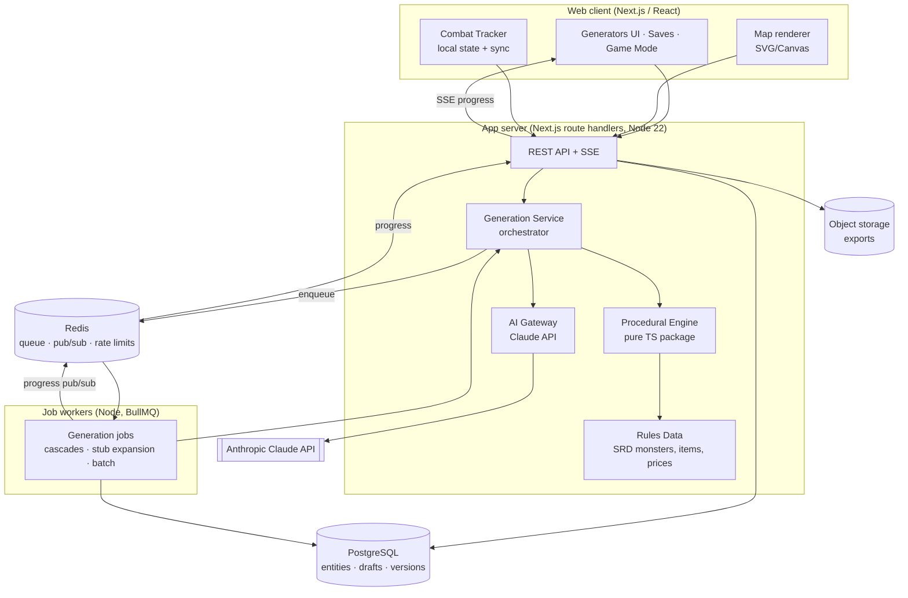
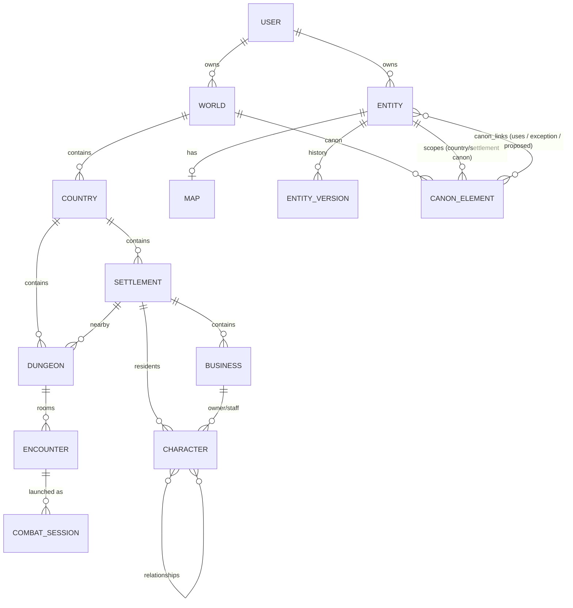
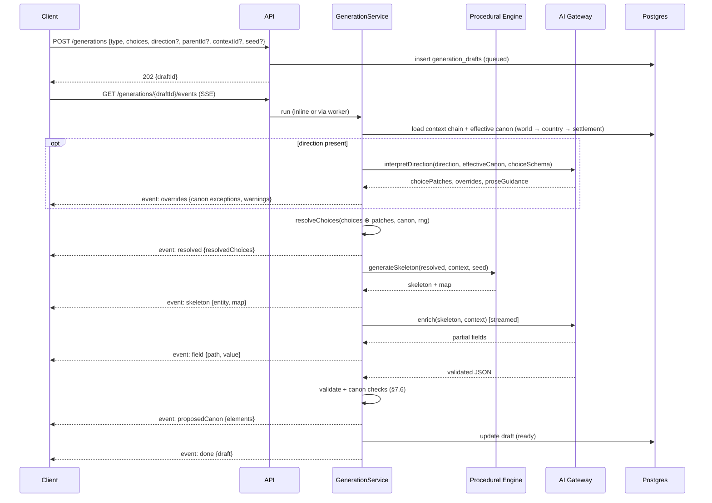

# Technical Design Document: Dungeon Master Companion

| | |
|---|---|
| **Status** | Draft v0.2 |
| **Date** | 2026-09-26 |
| **Related** | [PRD](./PRD.md) · [Application flow diagram](./assets/app-flow-diagram.png) |

---

## 1. Summary

This document describes how to build the Dungeon Master Companion defined in the [PRD](./PRD.md): a web application **for DMs only** with seven generators (World, Country, City, Business, Character, Dungeon, Encounter), a linked save library, a World Bible (canon), a Game Mode for use at the table, and a Combat Tracker. There are no player-facing features.

The core technical idea is a **hybrid generation pipeline**:

```
User choices (all optional) + DM direction (optional free text)
   → Effective canon (world → country → settlement: races, faiths, cultures, languages, economy…)
   → Direction interpretation (direction → choice patches, canon overrides, prose guidance)
   → Choice resolution (precedence: explicit choices > direction > canon > defaults)
   → Procedural engine (seeded; structure, numbers, maps)       ← source of truth for facts
   → AI enrichment (Claude; names, prose, personalities, hooks) ← structured JSON output
   → Validation + canon checks
   → Draft (Edit Choices ⇄ Regenerate loop) → Save (+ approve proposed canon)
```

The procedural engine owns every fact that must be correct and reproducible. The LLM owns everything that must *read well*. The LLM receives procedural facts as input and returns schema-constrained JSON. It never returns free text that we parse heuristically.

The **world canon** keeps generation consistent. When the DM clicks Generate with no input, every blank is filled from the canon of the place where the entity is being generated. References to religions, cultures, languages, and species are chosen from existing canon entries by ID, so generation cannot invent clashing ones by accident. The **DM direction** can steer within canon or deliberately override it. Overrides are recorded as entity-local exceptions and never change canon unless the DM chooses to.

---

## 2. Architecture



### 2.1 Components

| Component | Responsibility |
|---|---|
| **Web client** | All UI. Renders maps from vector map data. Owns Combat Tracker state (optimistic, synced). |
| **REST API + SSE** | CRUD for entities, the generation job lifecycle, progress streaming, search. |
| **Generation Service** | Orchestrates a generation: resolve choices → procedural → AI → validate → draft. It is the same code path in-request (small entities) and in workers (large or cascading). |
| **Canon** (`packages/canon`) | Pure functions for effective canon resolution, canon checks, and the factory that builds canon-constrained output schemas. It is shared by generation, attach, and the World Bible. |
| **Procedural Engine** (`packages/procgen`) | A pure, deterministic TypeScript library. Given `(choices, context, seed)` it returns the entity skeleton and map data. It has no I/O and is fully unit-testable. |
| **AI Gateway** (`packages/ai`) | The only module that talks to Claude. Handles prompt assembly, structured outputs, streaming, caching, retries, refusal fallback, usage metering, and batch jobs. |
| **Rules Data** (`packages/rules`) | Versioned JSON of openly licensed SRD content: species, classes, monsters with CR/XP, equipment and prices, treasure tables, encounter XP budgets. |
| **Job workers** | Run long or bulk generations (world cascades, stub expansion, Message Batches). |
| **PostgreSQL** | System of record. Relational hierarchy plus JSONB entity payloads. |
| **Redis** | Job queue (BullMQ), pub/sub for progress events, rate limiting. |

### 2.2 Why this shape

- **Monolith plus workers**, not microservices: one team, one deployable. The procedural and AI packages are cleanly separated libraries, so they can be split out later if needed.
- **Server-side AI calls only.** The API key never reaches the client. Usage is metered per user.
- **Maps as data, not images.** The procedural engine outputs vector geometry. The client renders it, which makes maps editable, zoomable, cheap to store, and consistent across hierarchy levels.

---

## 3. Technology Stack

| Layer | Choice | Rationale |
|---|---|---|
| Language | TypeScript (strict) everywhere | One language for client, server, and shared schemas. |
| Monorepo | pnpm workspaces + Turborepo | Shared `schemas`, `procgen`, `rules`, and `ai` packages. |
| Web | Next.js (App Router), React, Tailwind CSS, Radix UI primitives | SSR for Saves and Game Mode lists; route handlers for the API. |
| Client state | TanStack Query (server state), Zustand (Combat Tracker and editor state) | |
| Schemas | Zod | One definition gives runtime validation, TS types, and JSON Schema for Claude structured outputs. |
| DB / ORM | PostgreSQL 16, Drizzle ORM | JSONB and GIN indexes, `pg_trgm` for fuzzy search. |
| Queue | BullMQ on Redis | Retries, concurrency control, job progress. |
| AI | `@anthropic-ai/sdk` (Claude API) | Structured outputs, streaming, prompt caching, Message Batches. |
| Maps | d3-delaunay (Voronoi), simplex-noise, custom generators. Rendering with SVG (small maps) or PixiJS/Canvas (world maps). | |
| Auth | Auth.js (email magic link + OAuth) | |
| Storage | S3-compatible object storage | JSON, Markdown, and PDF exports. |
| Observability | OpenTelemetry → Grafana/Tempo, Sentry | Traces across API → worker → Claude. |
| Testing | Vitest, Playwright, fast-check (property-based) | |

---

## 4. Domain Model

### 4.1 Entity relationships



All seven types are stored in one polymorphic `entities` table (§5). The hierarchy is a `parent_id` tree with a `world_id` denormalized onto every row. **Any entity can be unattached** (`parent_id = null`, `world_id = null`), which supports standalone generation (PRD GEN-14/SV-3).

### 4.2 Allowed parent types

| Child type | Allowed parents |
|---|---|
| `world` | none |
| `country` | `world` |
| `settlement` | `country` |
| `business` | `settlement` |
| `character` | `settlement`, `business`, `dungeon`, `country`, `world` |
| `dungeon` | `country`, `settlement` |
| `encounter` | `dungeon` (optionally with `roomId`), `settlement`, `country` |

These rules are enforced in the service layer (`assertCanAttach(child, parent)`) and by a DB trigger as a backstop.

### 4.3 Shared envelope and schemas

Every entity uses the same envelope, with a type-specific `data` payload validated by Zod.

```ts
// packages/schemas/src/entity.ts
export const EntityType = z.enum([
  "world", "country", "settlement", "business", "character", "dungeon", "encounter",
]);

export const DetailLevel = z.enum(["stub", "full"]); // progressive detail, §6.5

export const EntityEnvelope = z.object({
  id: z.string().uuid(),
  type: EntityType,
  name: z.string(),
  summary: z.string(),            // one-liner, for lists
  parentId: z.string().uuid().nullable(),
  worldId: z.string().uuid().nullable(),
  detailLevel: DetailLevel,
  choices: z.record(z.unknown()), // user-supplied choices, as entered
  resolvedChoices: z.record(z.unknown()), // after blank-filling (shown in Edit Choices)
  seed: z.string(),
  locks: z.array(z.string()),     // JSON-pointer paths locked against regeneration
  tags: z.array(z.string()),
  notes: z.string(),              // DM free text
  direction: z.string().max(2000).nullable(), // DM direction prompt (PRD DIR-6)
  contextId: z.string().uuid().nullable(),    // where canon came from; defaults to parentId (PRD GEN-14)
  canonExceptions: z.array(CanonException),   // accepted overrides of canon (PRD DIR-4)
  proposedCanon: z.array(ProposedCanonElement), // new canon awaiting DM approval (PRD CAN-7)
  rulesetId: z.string(),          // e.g. "srd-5.2"
  schemaVersion: z.number().int(),
});
```

The choice schemas mirror the diagram exactly. Every field is `.optional()` (PRD GEN-1):

```ts
export const Percentages = z.record(z.number().min(0).max(100))
  .refine(sumsTo100OrEmpty, "Percentages must total 100");

export const WorldChoices = z.object({
  terrainPercentages: Percentages.optional(),        // "Select Terrain Percentages"
  countryCount: z.number().int().min(1).max(20).optional(), // "Select Amount of Countries"
  countryType: CountryType.optional(),               // "Select Country Type"
  raceMix: Percentages.optional(),                   // "Select Population/Race Mix Percentage"
  settlementTotals: z.object({                       // "Select City/Towns/Villages totals"
    city: z.number().int().min(0), town: z.number().int().min(0), village: z.number().int().min(0),
  }).partial().optional(),
  dungeonCount: z.number().int().min(0).max(200).optional(), // "Select Amount of Dungeons"
}).strict();

export const CountryChoices = z.object({
  countryType: CountryType.optional(),
  raceMix: Percentages.optional(),
  settlementSizes: z.record(SettlementTier, z.number().int().min(0)).optional(),
  economy: EconomyChoice.optional(),
  dungeonCount: z.number().int().min(0).optional(),
}).strict();

export const SettlementChoices = z.object({
  raceMix: Percentages.optional(),
  tier: SettlementTier.optional(),                   // Thorp … Metropolis
  economy: EconomyChoice.optional(),
  businesses: z.object({ total: z.number().int().optional(),
                         byType: z.record(BusinessType, z.number().int()).optional() }).optional(),
  dungeonCount: z.number().int().min(0).optional(),
}).strict();

export const BusinessChoices = z.object({
  businessType: BusinessType.optional(),
  ownerRace: z.string().optional(),
  prosperity: Prosperity.optional(),
}).strict();

export const CharacterChoices = z.object({
  race: z.string().optional(),
  physicalTraits: z.object({ age: AgeBand, build: z.string(), features: z.array(z.string()) }).partial().optional(),
  personalityTraits: z.array(z.string()).optional(),
  classOrJob: z.union([
    z.object({ kind: z.literal("class"), class: z.string(), level: z.number().int().min(1).max(20) }),
    z.object({ kind: z.literal("job"), job: z.string() }),
  ]).optional(),
}).strict();

export const DungeonChoices = z.object({
  terrain: Terrain.optional(),
  structure: DungeonStructure.optional(),
  level: z.number().int().min(1).max(20).optional(),
  roomCount: z.number().int().min(1).max(50).optional(),
}).strict();

export const EncounterChoices = z.object({
  terrain: Terrain.optional(),
  structure: EncounterStructure.optional(),
  level: z.number().int().min(1).max(20).optional(),
  creatureType: CreatureType.optional(),
  partySize: z.number().int().min(1).max(10).optional(),   // PRD assumption A4
  difficulty: z.enum(["low", "moderate", "high"]).optional(),
}).strict();
```

### 4.4 Key output payloads (abridged)

```ts
export const SettlementData = z.object({
  tier: SettlementTier,
  population: z.number().int(),
  demographics: z.array(z.object({ race: z.string(), count: z.number().int() })),
  economy: EconomyProfile,          // prosperity, industries, priceModifier, exports, imports
  government: z.object({ type: z.string(), leaderId: z.string().uuid().nullable(), description: z.string() }),
  description: z.string(),
  districts: z.array(z.object({ id: z.string(), name: z.string(), description: z.string() })),
  landmarks: z.array(z.object({ name: z.string(), description: z.string() })),
  rumors: z.array(z.object({ text: z.string(), truth: z.enum(["true", "partly", "false"]),
                             refs: z.array(z.string().uuid()) })),
});

export const StatBlock = z.object({ // consumed by the Combat Tracker
  ac: z.number().int(), hp: z.number().int(), hitDice: z.string().optional(),
  initiativeMod: z.number().int(), speed: z.string(),
  abilities: z.object({ str: z.number(), dex: z.number(), con: z.number(),
                        int: z.number(), wis: z.number(), cha: z.number() }),
  cr: z.string().optional(), xp: z.number().int().optional(),
  actions: z.array(z.object({ name: z.string(), text: z.string() })),
  sourceRef: z.string().optional(), // e.g. "srd-5.2:monster/goblin-warrior"
});
```

Canon references in payloads are **IDs, not strings**. For example, `CharacterData` has `speciesId`, `cultureId`, `faithId`, `languageIds[]`, and `dialectId`, and `SettlementData.faiths` is `{ faithId, share, templeIds[] }[]`. Anything that is a canon element is referenced by ID, which is what makes the consistency checks in §7.6 mechanical.

The full schemas live in `packages/schemas` and are the single source of truth for the DB payload validation, the API contracts, and the Claude output formats.

### 4.5 Canon model

Canon (PRD §4.2) is stored as **canon elements**: small, typed records that belong to a world and have a **scope**, which is the world itself, a country, or a settlement.

```ts
export const CanonKind = z.enum([
  "species", "deity", "faith", "culture", "language", "dialect",
  "currency", "tradeGood", "industry", "faction", "polity", "historicalEvent",
  "worldRule", // magic/tech level, cosmology, tone, content boundaries
  "custom",
]);

export const CanonElement = z.object({
  id: z.string().uuid(),
  worldId: z.string().uuid(),
  scopeId: z.string().uuid(),       // world, country, or settlement entity id
  kind: CanonKind,
  name: z.string(),
  summary: z.string(),
  data: z.record(z.unknown()),      // kind-specific, see below
  status: z.enum(["established", "proposed"]),
  sourceEntityId: z.string().uuid().nullable(), // the generation that introduced it
});

// Kind-specific payloads (abridged)
const FaithData = z.object({
  deityIds: z.array(z.string().uuid()), clergyTitle: z.string(), holyDays: z.array(z.string()),
  tenets: z.array(z.string()), symbols: z.array(z.string()),
});
const LanguageData = z.object({
  script: z.string(),
  naming: z.object({                // drives name generation (§8.9)
    personPatterns: z.array(z.string()), placePatterns: z.array(z.string()),
    phonemes: z.object({ onsets: z.array(z.string()), vowels: z.array(z.string()), codas: z.array(z.string()) }),
    examples: z.array(z.string()),  // 10–30 example names, used as few-shot style anchors
  }),
});
const DialectData = LanguageData.partial().extend({ parentLanguageId: z.string().uuid(),
                                                    quirks: z.array(z.string()) });
const CultureData = z.object({
  influences: z.array(z.object({ cultureId: z.string().uuid(), weight: z.number() })),
  values: z.array(z.string()), customs: z.array(z.string()), dress: z.string(), cuisine: z.string(),
  architecture: z.string(), primaryLanguageId: z.string().uuid(),
});

// A scope's stance toward canon elements it inherits (country/settlement level)
export const ScopePolicy = z.object({
  speciesMix: z.record(z.string().uuid(), z.number()),           // speciesId → %
  faiths: z.array(z.object({ faithId: z.string().uuid(), share: z.number(),
                             status: z.enum(["state", "tolerated", "minority", "banned", "secret"]) })),
  cultures: z.array(z.object({ cultureId: z.string().uuid(), share: z.number() })),
  languages: z.array(z.object({ languageId: z.string().uuid(), dialectId: z.string().uuid().nullable(),
                                share: z.number() })),
  currencyId: z.string().uuid().nullable(),
  excludedKinds: z.record(CanonKind, z.array(z.string().uuid())), // e.g. species absent here
});

export const CanonException = z.object({ // an override recorded on an entity (PRD DIR-4)
  path: z.string(),                        // JSON pointer in the entity, e.g. "/data/speciesId"
  canonRule: z.string(),                   // human-readable: "Kharvos has no dwarves"
  scopeId: z.string().uuid(),
  source: z.enum(["direction", "manualEdit", "attach"]),
});
```

- The **world** defines the full set of elements, such as every species, deity, and language that exists.
- **Countries and settlements** each carry a `ScopePolicy` that selects and weights the elements present there and may add local elements (a dialect, a local saint, a guild).
- The **effective canon** for a location is the world's elements, filtered and weighted by each `ScopePolicy` down the chain. The most specific scope wins (§6.6).

---

## 5. Persistence

### 5.1 Tables

```sql
create table entities (
  id              uuid primary key default gen_random_uuid(),
  owner_id        uuid not null references users(id),
  type            text not null check (type in ('world','country','settlement','business','character','dungeon','encounter')),
  parent_id       uuid references entities(id) on delete set null,
  world_id        uuid references entities(id) on delete cascade,
  name            text not null,
  summary         text not null default '',
  detail_level    text not null default 'full',
  choices         jsonb not null default '{}',
  resolved_choices jsonb not null default '{}',
  seed            text not null,
  locks           text[] not null default '{}',
  data            jsonb not null,             -- type-specific payload (Zod-validated)
  tags            text[] not null default '{}',
  notes           text not null default '',
  ruleset_id      text not null,
  schema_version  int  not null,
  version         int  not null default 1,     -- optimistic concurrency
  created_at      timestamptz not null default now(),
  updated_at      timestamptz not null default now(),
  deleted_at      timestamptz
);
create index on entities (owner_id, type, updated_at desc) where deleted_at is null;
create index on entities (parent_id) where deleted_at is null;
create index on entities (world_id, type) where deleted_at is null;
create index entities_search on entities using gin ((name || ' ' || summary) gin_trgm_ops);

create table entity_versions (   -- PRD SV-6
  entity_id uuid references entities(id) on delete cascade,
  version   int,
  snapshot  jsonb not null,       -- full envelope + data
  created_at timestamptz not null default now(),
  primary key (entity_id, version)
);

create table maps (
  entity_id  uuid primary key references entities(id) on delete cascade,
  kind       text not null check (kind in ('world','region','settlement','floorplan','dungeon')),
  seed       text not null,
  width      int not null, height int not null,
  geometry   jsonb not null,        -- see §8; large world maps may spill to object storage
  overlays   jsonb not null default '{}' -- DM annotations
);

create table canon_elements (     -- world canon, PRD §4.2 (World Bible)
  id          uuid primary key default gen_random_uuid(),
  owner_id    uuid not null,
  world_id    uuid not null references entities(id) on delete cascade,
  scope_id    uuid not null references entities(id) on delete cascade, -- world/country/settlement
  kind        text not null,
  name        text not null,
  summary     text not null default '',
  data        jsonb not null,
  status      text not null default 'established' check (status in ('established','proposed')),
  source_entity_id uuid references entities(id) on delete set null,
  version     int not null default 1,
  updated_at  timestamptz not null default now()
);
create unique index on canon_elements (world_id, kind, lower(name));
create index on canon_elements (world_id, kind);
create index on canon_elements (scope_id);

create table canon_links (        -- which entities use which canon (drives CAN-9/CAN-10)
  entity_id uuid references entities(id) on delete cascade,
  canon_id  uuid references canon_elements(id) on delete cascade,
  kind      text not null check (kind in ('uses','exception','proposed')),
  path      text not null,         -- JSON pointer of the reference in the entity
  primary key (entity_id, canon_id, path)
);
create index on canon_links (canon_id);

create table relationships (      -- character↔character and cross-links (rumor refs, etc.)
  from_id uuid references entities(id) on delete cascade,
  to_id   uuid references entities(id) on delete cascade,
  kind    text not null,           -- 'family','employer','rival','ally','mentions'
  note    text,
  primary key (from_id, to_id, kind)
);

create table generation_drafts (  -- the unsaved Generate ⇄ Edit Choices loop
  id          uuid primary key,
  owner_id    uuid not null,
  entity_type text not null,
  parent_id   uuid,                -- where it will be saved
  context_id  uuid,                -- where its canon comes from (defaults to parent_id)
  choices     jsonb not null,
  direction   text,                -- DM direction prompt
  interpretation jsonb,            -- DirectionInterpretation (§6.7), cached per direction text
  result      jsonb,               -- envelope + data + children + map
  status      text not null,       -- 'queued','running','ready','failed'
  job_id      text,
  expires_at  timestamptz not null -- 7-day TTL (PRD GEN-11)
);

create table combat_sessions (
  id          uuid primary key,
  owner_id    uuid not null,
  encounter_id uuid references entities(id) on delete set null,
  state       jsonb not null,       -- §10
  version     int not null default 1,
  updated_at  timestamptz not null default now()
);

create table ai_usage (             -- metering (PRD AI-5)
  id bigserial primary key, owner_id uuid not null, draft_id uuid, model text not null,
  input_tokens int, output_tokens int, cache_read_tokens int, cache_write_tokens int,
  batch boolean not null default false, created_at timestamptz not null default now()
);
```

### 5.2 Design notes

- **Polymorphic table plus JSONB.** The seven types share lifecycle, hierarchy, search, tags, and versioning. Type-specific fields change often during development, and JSONB with Zod validation on write avoids migration churn. Fields that are queried often (tier, business type, CR) can be promoted to generated columns later.
- **Save is a transaction.** Saving a draft inserts the root entity plus all generated children, maps, and relationships in one transaction (PRD SV-2).
- **Optimistic concurrency** on `version` for edits (`UPDATE … WHERE id=$1 AND version=$2`).
- **Soft delete.** Parent deletion runs a recursive CTE over `parent_id` to either soft-delete the subtree or null out the children's `parent_id` (PRD SV-4).
- **Row-level ownership.** Every query is scoped by `owner_id`. Postgres RLS is enabled as defense in depth.
- **Canon in its own table.** Canon elements are shared by many entities, edited on their own in the World Bible, and queried by kind ("all faiths in Kharvos"). Keeping them apart from `entities` keeps the World Bible fast and lets `canon_links` answer "who worships X?" and "what breaks if I delete this deity?" (PRD CAN-10).
- **Canon edits don't rewrite entities.** Editing canon bumps its `version`. Existing entities keep their text, and `canon_links` finds entities that may now be stale (PRD CAN-8, CAN-10).

---

## 6. Generation Pipeline

### 6.1 Stages



1. **Load context and canon.** Walk from `contextId` (default: `parent_id`) up to the root, and collect a compact **context digest** for each ancestor: name, type, summary, terrain, tone and content settings, plus the sibling names in scope (to avoid duplicates). Then compute the **effective canon** for that location (§6.6). With no world (PRD GEN-14 "No world"), the effective canon is empty and generic defaults apply.
2. **Interpret the direction** (only if the DM typed one). This turns the free text into structured choice patches, canon overrides, and prose guidance (§6.7).
3. **Resolve choices.** Each generator has a `resolve(choices, canon, rng)` function that fills every blank field. Precedence (PRD DIR-5): *explicit DM choices and locks → direction patches → effective canon → type-specific defaults*. Blanks are drawn from canon distributions: species from the local species mix, faith from local faith shares, and so on. The output is `resolvedChoices`, and each value is tagged with its source (`dm`, `direction`, `canon`, or `default`) for Edit Choices (PRD GEN-3, DIR-2).
4. **Procedural skeleton.** `procgen` produces all structural and numeric facts plus the map (§8), including the canon references (IDs) for the entity and its children. IDs for child entities are allocated here.
5. **AI enrichment.** The AI Gateway sends the skeleton, the context digest, the relevant effective canon, and the direction's prose guidance, and receives the prose fields as structured JSON (§7).
6. **Validation.** A Zod parse, then the canon and consistency checks (§7.6). New canon the generation introduced is collected as `proposedCanon`.
7. **Draft.** The result is stored in `generation_drafts`. The DM iterates or saves. On save, the DM accepts or rejects the proposed canon (§6.8).

Small generations (a character, a business, an encounter) run **inline** in the request, streaming over SSE. Large ones (a world, a country, a city with children) run in a **worker**, and progress is relayed through Redis pub/sub to the same SSE endpoint.

### 6.2 Seeds and determinism

- A seed is a string. Every sub-generator derives a child RNG with `rng.fork(label)` (for example, `seed/settlement:3/business:7`), so adding one business doesn't reshuffle the others.
- The RNG is a small, fast PRNG (sfc32 or xoshiro128\*\*) seeded from a 128-bit hash of the seed string (e.g. cyrb128).
- **Procedural output is fully deterministic** for `(choices, context, seed, engineVersion)`. AI output is not. Reproducing a draft therefore means re-running procgen and reusing the stored AI text.

### 6.3 The Edit Choices ⇄ Regenerate loop

| User action | Behavior |
|---|---|
| Edit a choice, Regenerate | New seed (unless "keep seed" is checked). Re-run from step 3, reusing the cached direction interpretation. Locked paths are copied from the previous draft and passed to the AI as fixed facts. |
| Edit the direction, Regenerate | Re-run from step 2. The old direction's patches are dropped, but choices the DM set explicitly are kept. |
| Regenerate one field (GEN-5) | Only step 5, scoped to one JSON path, with an optional one-off direction (PRD DIR-6). The rest of the entity is passed as context. |
| Undo an override (DIR-4) | Removes the exception, re-resolves that path from canon, and regenerates the affected fields. |
| Add an override to canon (DIR-4) | Creates or updates a canon element or `ScopePolicy` at the scope the DM picks, and turns the exception into a normal `uses` link. |
| Lock a field or child (GEN-4) | Adds its JSON pointer to `locks`. Locked child entities keep their ID and subtree. |
| Hand-edit a field (GEN-6) | Patches the draft (or the saved entity). The edited path is automatically locked. |

The lock-merge rule: after the new skeleton is generated, every locked path is overwritten with its previous value **before** AI enrichment, so the prose is written around the locked facts. Locked numeric facts that conflict with new choices (for example, a locked population of 12,000 with the tier changed to Village) raise a validation warning in the UI. They are not silently changed.

### 6.4 Cascading generation

Parent generators create children. The cascade is a job DAG:

```
world skeleton + map ─▶ world canon (AI) ─▶ country[1..N] canon + stub ─┬─ settlement[1..M] (stub)
                                                                        └─ dungeon[1..K] (stub)
```

The world canon is generated first because everything below it depends on it: the World generator's choices and direction, together with the map (terrain and adjacency), determine the species, faiths, cultures, and languages. Each country's `ScopePolicy` (local species mix, faiths, dialects) is then generated from the world canon and the country's position on the map. Only after that are its settlement and dungeon stubs created.

Workers run sibling jobs in parallel (bounded concurrency per user, default 4) and publish progress events `{stage, completed, total}`.

### 6.5 Progressive detail (stubs)

Generating a full world at full depth would mean thousands of AI-written entities, which is too slow and too expensive. Instead:

- **Stub**: the procedural skeleton plus a name and one-line summary, produced by a single batched AI call per parent ("name and summarize these 12 settlements").
- **Full**: the complete AI enrichment, including children one level down (for a settlement: businesses plus owners, notable NPCs).
- A stub is expanded **on demand** when the user opens it in the editor or in Game Mode ("Expand" button, or automatically on first open, per user setting). Bulk expansion ("expand all of Country X") runs through the Message Batches API at lower cost (§7.5).
- Expansion is idempotent. The `detail_level` flip and the child inserts happen in one transaction.
- Stubs already carry their canon references (species mix, faiths, dialect) from procgen, so expanding one later can't drift from canon.

### 6.6 Effective canon resolution

```ts
// packages/canon/src/effective.ts  (pure)
export function effectiveCanon(chain: ScopeNode[] /* world → … → nearest */): EffectiveCanon {
  // 1. Start with all established world elements (status = 'established').
  // 2. For each scope down the chain, apply its ScopePolicy:
  //      - speciesMix / faiths / cultures / languages: replace the weights with this scope's (renormalized)
  //      - excludedKinds: remove elements that aren't present here
  //      - add scope-local elements (a dialect, a local saint, a guild)
  // 3. Where a scope has no policy for a category, inherit the parent's with a small Dirichlet
  //    perturbation drawn from a seeded RNG (§8.5), so sibling towns differ slightly but plausibly.
  // 4. Return: allowed element IDs per kind, weights, statuses (state/banned…), naming rules
  //    for the local language or dialect, and the world rules (magic level, tone, content boundaries).
}
```

- The result is **memoized** per `(scopeId, canonVersionHash)`, and invalidated when any canon element or policy in the chain changes.
- The same `EffectiveCanon` feeds three places: procedural choice resolution (weighted draws), the Zod schema factory for AI output (allowed IDs, §7.2), and the canon checks (§7.6).
- **Border and trade influence (P1).** A settlement near a border, or on a trade route, blends in a weighted share of the neighboring scope's cultures, languages, and trade goods. The map (§8.1) supplies the adjacency.

### 6.7 Direction interpretation and overrides

The DM's direction is interpreted **once per direction text** by a small, low-effort AI call. The result is cached on the draft.

```ts
export const DirectionInterpretation = z.object({
  choicePatches: z.record(z.unknown()),       // e.g. { "classOrJob": {kind:"job", job:"tax collector"} }
  canonRefs: z.array(z.object({ canonId: z.string().uuid(), path: z.string() })), // "worships Tor" → faithId
  overrides: z.array(z.object({               // requests that contradict effective canon
    path: z.string(), requested: z.string(), canonRule: z.string(),
    kind: z.enum(["absentElement", "bannedElement", "newElement", "factContradiction"]),
  })),
  newElements: z.array(z.object({ kind: CanonKind, name: z.string(), summary: z.string() })),
  proseGuidance: z.string(),                  // the rest of the direction, for enrichment
  conflictsWithExplicitChoices: z.array(z.object({ field: z.string(), note: z.string() })),
});
```

Processing steps:
1. **AI parse.** The model sees the direction, the generator's choice schema, and a compact index of the effective canon (IDs, names, statuses), and returns a `DirectionInterpretation`. This call uses structured outputs.
2. **Deterministic verification.** Every patch is validated against the choice schema. Every `canonRef` must exist. Each claimed override is re-checked against `EffectiveCanon`, which drops any the model flagged by mistake. Patches that reference absent or banned elements, but which the model did not flag, are added as overrides. The deterministic check is what decides; the model's classification is only a proposal.
3. **Apply by precedence** (PRD DIR-5). Explicit DM choices beat patches. Conflicts go to `conflictsWithExplicitChoices` and are shown as warnings.
4. **Record overrides as exceptions.** Each override becomes a `CanonException` on the draft, with `source: "direction"`. Resolution uses the requested value for that path only; every other path still resolves from canon. The client gets an `overrides` SSE event and shows the non-blocking notice with **Add to canon** and **Undo** (PRD DIR-3, DIR-4).
5. **New elements the DM asked for** ("worships a forgotten sea goddess") are created as `proposed` canon elements that the entity uses. When saving, they are either kept local to the entity or promoted to canon (§6.8).
6. **Prose guidance** is passed to enrichment inside `<dm_direction>`. The enrichment prompt says that the DM's direction takes priority over canon **only for the listed exceptions**, and that everything else must follow canon.

Without a direction, steps 1–6 are skipped. This is the **Generate as-is** path (PRD GEN-12), which is canon-only by construction.

### 6.8 Canon growth, attach, and adapt

- **Proposed canon (PRD CAN-7).** Enrichment may invent canon-worthy things, such as a local cult or a noble house. The enrichment schema has an explicit `newCanon[]` field for these. The model is told to use it rather than slip new elements into prose, and the canon audit (§7.6) catches the ones it slips in anyway. On save, the Save dialog lists them. **Accept** creates an established `canon_elements` row at the chosen scope. **Keep local** leaves it as entity-only data. **Remove** regenerates the affected prose without it.
- **Attach or move (PRD CAN-9).** `POST /entities/{id}/attach` computes the target's effective canon and diffs the entity's canon references against it: absent species, banned or unknown faiths, the wrong language or dialect, the wrong currency. If there are clashes, it returns `409 canon_conflict` with the list. The client then calls `attach` again with one of these resolutions:
  - `keepAsExceptions`: records each clash as a `CanonException` with `source: "attach"`.
  - `adapt`: an AI rewrite job. It re-resolves the clashing paths from the new canon (for example, a new faith drawn from local shares, or a name re-rolled in the local dialect), keeps locked fields, and rewrites only the prose that mentions the changed facts. The job produces a draft diff for the DM to review before it is committed.
- **Consistency report (PRD CAN-10, P2).** When canon changes, `canon_links` finds the entities that reference changed or removed elements. A background job scores each one and lists those with clashes, each with one-click adapt.

---

## 7. AI Integration

### 7.1 Model selection

| Use | Model | Settings |
|---|---|---|
| All generation routes (default) | `claude-opus-5` | Adaptive thinking, `effort` tuned per route: `low` for stubs and names, `medium` for single entities, `high` for world canon generation and consistency repair. |
| Direction interpretation (§6.7) | `claude-opus-5` | `effort: "low"`, structured output, small `max_tokens`. It runs before generation, so latency matters. |
| Canon audit of prose (§7.6) | `claude-opus-5` | `effort: "low"`. Runs only when the lexical pass finds unknown proper nouns. |
| Adapt to world (§6.8) | `claude-opus-5` | `effort: "medium"`. |
| Ask the World (Q&A, PRD GM-8) | `claude-opus-5` | Streaming, `effort: "medium"`. |

The model ID and effort are **configured per route** in `packages/ai/routes.ts`, not hard-coded at call sites. Moving high-volume routes (stubs, names) to a cheaper model such as `claude-sonnet-5` or `claude-haiku-4-5` is a cost/quality decision for the product owner. It should be made from eval results (§7.9), not assumed up front. Lowering effort on the same model is the first lever to measure.

### 7.2 Structured outputs

Every AI call returns JSON constrained to a schema derived from the same Zod schema used for storage. We use the SDK's `messages.parse()` with `zodOutputFormat`:

```ts
// packages/ai/src/enrich.ts
import Anthropic from "@anthropic-ai/sdk";
import { zodOutputFormat } from "@anthropic-ai/sdk/helpers/zod";

const client = new Anthropic();

export async function enrichSettlement(skeleton: SettlementSkeleton, ctx: ContextDigest) {
  const response = await client.messages.parse({
    model: ROUTES.settlementFull.model,           // "claude-opus-5"
    max_tokens: 16000,
    thinking: { type: "adaptive" },
    output_config: {
      effort: ROUTES.settlementFull.effort,       // "medium"
      format: zodOutputFormat(SettlementEnrichment),
    },
    system: [
      { type: "text", text: SYSTEM_PROMPT },                        // stable
      { type: "text", text: renderWorldBible(ctx.world),            // stable per world
        cache_control: { type: "ephemeral" } },
    ],
    messages: [{ role: "user", content: renderSettlementTask(skeleton, ctx) }],
  });

  if (response.stop_reason === "refusal") throw new AIRefusalError(response.stop_details);
  if (!response.parsed_output) throw new AISchemaError(response);
  return response.parsed_output;
}
```

- **Enrichment schemas contain only prose fields** (names, descriptions, personalities, hooks). They never contain numeric facts. The service merges the enrichment into the skeleton, so the model *cannot* override population, prices, or CR (PRD AI-3).
- The enrichment schema refers to skeleton items by the IDs procgen allocated (`{ businessId, name, description }`), so merging is by key, never by position.
- **Canon-constrained schemas.** Enrichment schemas are built per request by a factory, `enrichmentSchema(type, effectiveCanon, exceptions)`. Any field the model may fill with a canon reference (for example, the deity a temple is dedicated to, or the language an NPC's catchphrase is in) is a `z.enum([...allowedIds])` of the canon elements allowed at that location, plus any exception IDs. The model therefore *cannot* output a reference to a faith or species that doesn't belong there. When an allowed set is very large (more than about 200 IDs), the field becomes a plain string and is checked after generation instead. New inventions go in the separate `newCanon[]` field (§6.8).
- Long outputs (a full settlement with 15 businesses) use `client.messages.stream(...)` with `finalMessage()` to avoid HTTP timeouts. Partial deltas are forwarded to the client as `field` SSE events for the progressive UI (PRD GEN-9).

### 7.3 Prompt design and context assembly

The prompt is layered, from most stable to least stable, so prompt caching works (§7.4):

1. **System prompt (global, static).** Role ("worldbuilding assistant for a tabletop DM"), style guide, output rules, and licensing guardrails (use SRD creature and spell names; invent original names for everything else). The output rules are:
   - Write only the fields in the schema.
   - Facts in `<facts>` and canon in `<canon>` are established and must not be contradicted.
   - Don't mention religions, species, languages, or factions that aren't in `<canon>`. If something new is needed, put it in `newCanon`.
   - Don't reuse names in `<taken_names>`.
   - Follow `<dm_direction>`. Where it conflicts with canon, only the exceptions listed in `<exceptions>` are allowed.
2. **World canon (per world, changes rarely).** The world's overview, tone, content boundaries, and every established world-scope element in compact form: species, pantheon and faiths, cultures, languages with their naming rules and example names, currencies, factions, and a history outline. It is cached.
3. **Regional canon (per country, changes rarely).** The country's `ScopePolicy` and local elements (state and banned faiths, dialects, cultures, currency, local factions). It is cached as a second prefix.
4. **Task message (per request).** The settlement-level canon and effective weights, the ancestor digest chain, the procedural facts as `<facts>` JSON (with canon references resolved to names), locked values, `<exceptions>`, taken names, `<dm_direction>` (the prose guidance), and the instruction for this generator.

The context digest is size-bounded (target ≤ 4k tokens). Deep ancestors contribute only a name and summary. Siblings contribute only names. The world canon block is size-bounded too (target ≤ 8k tokens): when a world outgrows it, the lowest-relevance categories (old history, distant factions) are cut to name plus one line, and full entries are included only when the task or direction mentions them (lexical match on names and aliases).

### 7.4 Prompt caching

- `cache_control` breakpoints after the world canon and after the regional canon. All generations inside one world share the prefix `system prompt + world canon`, and generations inside one country also share the regional canon. This cuts input cost and latency for cascades, stub expansion, and in-session quick generates.
- Canon edits change the world-canon block and so invalidate its cache. That is expected, and rare compared with generations.
- The rendering is deterministic: sorted keys, no timestamps or request IDs before the breakpoint. A CI test renders the prefix twice and asserts byte equality.
- We monitor `usage.cache_read_input_tokens` per route. An alert fires if the hit rate drops below the expected level, which signals a silent invalidation.

### 7.5 Bulk generation with Message Batches

"Expand all stubs in this country" and similar bulk jobs (PRD AI-6) are submitted with `client.messages.batches.create(...)`. Batches run asynchronously at lower cost. Each request's `custom_id` is the entity ID. Results are keyed by `custom_id`, never by position. The worker polls until `processing_status === "ended"`, validates each result, and commits the successful expansions. Failed items fall back to per-entity requests.

### 7.6 Validation and consistency checks

After Zod parsing, rule-based checks run over the merged entity:

| Check | Action on failure |
|---|---|
| Name uniqueness within scope (settlement, country) | Regenerate that name field only. |
| **Canon references**: every canon ID in the payload is allowed by the effective canon or covered by a `CanonException` | Should be impossible with constrained enums (§7.2). For string fallbacks: re-resolve from canon and regenerate the affected prose. |
| **Canon audit of prose**: proper nouns in the prose are matched against the world's name index (entities, canon names and aliases). Unknown proper nouns are classified by a low-effort AI call as *harmless* (a tavern's pet dog), *new canon* (a deity, faith, species, language, faction, or event), or *clash* (a known element that isn't allowed here, such as a banned god worshipped openly). | New canon → added to `proposedCanon`. Clash → targeted re-ask of that field with the rule stated. |
| **Naming conformance**: new person and place names are scored against the local language's naming rules (phoneme and pattern match, §8.9) | A name below the threshold is re-rolled through the procedural name generator. |
| Prose mentions numbers that contradict facts (e.g. "a village of 20,000") | A regex/NER pass over the prose flags the conflict → targeted re-ask with the conflict listed. |
| References to entity IDs that don't exist | Strip the reference. |
| Race or species mentioned but not in the ruleset or custom list | Warn (the DM may want homebrew). |
| Content-boundary terms (the DM's "lines") present | Re-ask with a stronger instruction, then fall back to redaction plus a user notice. |

There are at most 2 repair attempts per entity. After that, the draft is saved with the failing fields flagged `needsReview` (PRD AI-4).

### 7.7 Reliability, safety, and fallbacks

- **Retries.** The SDK retries 408/409/429/5xx and connection errors (default 2). The gateway catches typed errors (`Anthropic.RateLimitError`, `Anthropic.APIError`, …) to separate retryable failures from fatal ones.
- **Refusals.** The code always checks `stop_reason` before reading content. Requests opt into server-side refusal fallback (`fallbacks: "default"` with beta header `server-side-fallback-2026-07-01`) so a declined request is retried on Anthropic's recommended fallback model. Since fantasy violence is normal content in this domain, refusals are expected to be rare. They are logged with their category for review.
- **Degraded mode.** If AI is unavailable, generators still return the procedural skeleton with placeholder names from local name tables (`packages/rules/names`) and flag the prose fields "pending". Game Mode and the Combat Tracker never depend on live AI calls (PRD NFR availability).
- **Direction vs. data.** The DM's direction is a trusted instruction from the app's only user. It is passed in `<dm_direction>` and is allowed to steer. Other stored text (notes, imported JSON, earlier generated prose) goes in the prompt only as delimited data, never as instructions. The model has no tools, so any stray instruction in that data can at worst alter prose.

### 7.8 Cost controls

- Per-user monthly generation quota, enforced in Redis before a job is enqueued. Usage is recorded in `ai_usage`.
- Stubs by default. Full expansion only on demand.
- Prompt caching for all in-world calls, and batches for bulk jobs.
- Per-route `max_tokens` ceilings, sized with headroom so outputs aren't truncated.
- A dashboard of cost per completed generation by route. The target budget per full city generation is set once the M1 eval baseline exists.

### 7.9 Evaluation

A golden set of about 50 generation requests per entity type (varied choices and contexts) is run in CI nightly against the configured routes. The graders are:

- **Deterministic:** schema validity, name uniqueness, fact-contradiction rate, **unrequested canon clash rate** (PRD target < 1 per 100), naming conformance, content-boundary violations, latency, and tokens.
- **Direction set:** paired cases of a direction plus a canon fixture, labeled with expected patches and overrides. It measures override precision and recall (false overrides, and missed ones) and patch accuracy.
- **Rubric (LLM-judge + periodic human review):** flavor, usefulness at the table, fit with the tone, and **direction adherence** (did the result do what the DM asked; PRD target > 95%).

Any change to a prompt, model, or effort setting must hold or improve the scores before it merges.

### 7.10 Ask the World (RAG, P1)

- **Retrieval:** Postgres full-text and trigram search, plus a hierarchy-scoped filter (the current world, the current location's subtree first). Embeddings (`pgvector`) are added only if lexical retrieval proves insufficient.
- **Generation:** the top-k entity digests go into the prompt, and the answer must cite entity IDs. The UI renders the citations as links (PRD GM-8).

---

## 8. Procedural Engines (`packages/procgen`)

All generators are pure functions: `(resolvedChoices, context, rng) → skeleton`.

### 8.1 World and region maps
1. Poisson-disc sample about 8–20k points and build a Voronoi diagram (d3-delaunay).
2. Elevation from layered simplex noise plus continent masks. Sea level is chosen so the water percentage matches the target.
3. Moisture and temperature fields → biome classification. Then **iterative threshold adjustment** until the biome shares are within ±5 pp of the requested terrain percentages (PRD WG-1).
4. Rivers flow downhill from high-moisture peaks. Lakes form at local minima.
5. **Countries:** N seeds weighted by habitability → a region-growing flood fill with a cost function that penalizes crossing mountains and rivers (PRD WG-2).
6. **Settlements:** habitability score (water access, arable biome, coast) → weighted sampling with a minimum spacing that scales with tier. The capital is placed at the country's highest-scoring cell.
7. **Dungeons:** inverse habitability (remote, mountains, swamps) with a minimum distance from settlements (PRD WG-3).
8. **Roads:** A\* between settlements over a terrain-cost grid, then deduplicated into a network.

A **country map** is the world map cropped to the country's cells and re-sampled at higher density with the same seed-derived noise, so borders and coastlines match the world map (PRD CG-1). A standalone country gets a synthetic surrounding region.

### 8.2 Settlement maps
- Walls and footprint scale with tier. A primary road enters from the world-map road directions.
- Street network: a main-road skeleton plus recursive subdivision into blocks (a simplified Watabou-style approach). Districts are Voronoi regions labeled by type (market, temple, docks, residential, slums, noble).
- Businesses are placed on lots, weighted by district affinity (a smithy near the gate, a jeweler in the noble district).

### 8.3 Business floor plans
- Templates by business type (a tavern is common room + bar + kitchen + cellar + rooms upstairs), laid out on a grid by a small constraint solver. Prosperity scales size and furnishings.

### 8.4 Dungeon maps
- BSP partition, or room placement plus minimum spanning tree plus a few extra edges for loops (structure-dependent: caves use cellular automata; crypts use symmetric grid templates).
- **Invariant:** exactly `roomCount` rooms, all reachable (graph BFS check, property-tested) (PRD DG-1).
- Room roles (entrance, guard post, lair, treasure, trap, boss) are assigned by graph depth from the entrance.

### 8.5 Population and demographics
- Population is sampled log-uniformly within the tier's range (table in `packages/rules/settlements.json`).
- Race counts use a **largest-remainder allocation** of the population against the race mix, so counts are integers that sum exactly to the population (PRD CT-1).
- Child mix = parent mix + a Dirichlet perturbation (concentration configurable), renormalized to 100. Inside a world, the base mix is the effective canon's `speciesMix` (§6.6), so a species absent from the scope can never be drawn.
- **Faiths, cultures, and languages** are allocated the same way: a settlement's faith shares come from the country's, and temples and shrines are placed in proportion (banned faiths get only hidden shrines). A settlement's dialect is the country's dialect for its region.

### 8.6 Economy
```ts
type EconomyProfile = {
  prosperity: "destitute" | "poor" | "modest" | "comfortable" | "wealthy" | "opulent";
  industries: Industry[];        // derived from terrain and biome (mines near mountains, fishing on the coast)
  exports: TradeGood[]; imports: TradeGood[];
  priceModifier: number;         // multiplier on ruleset base prices
  taxRate: number;
};
```
- Country economy → settlement economy (inherited with variance; a trade-route or road-hub bonus) → business prosperity (settlement prosperity ± variance).
- **Price** = ruleset base price × settlement `priceModifier` × a scarcity factor (import vs. export) × a business prosperity factor, rounded to sensible coinage (PRD BG-1).
- Business counts per type come from per-tier demand tables (supports-per-population), gated by prosperity and industries (PRD CT-2).

### 8.7 Encounter balancing
- The rules package exposes the ruleset's encounter XP budget per character by level and difficulty, and the monster list with CR, XP, type, and environments.
- **Algorithm:** filter monsters by creature type and terrain → a randomized search (weighted bounded knapsack) for a group whose total XP falls in `[0.85, 1.0] × budget`, preferring 1–3 distinct stat blocks and group sizes that are practical at the table → return the stat block references (PRD EN-1).
- It is property-tested: for every valid input, the result's XP is within the budget window, or the generator returns an explicit "no valid combination" result with the closest alternative.

### 8.8 Characters
- Procedural: species (drawn from the effective species mix), culture, faith, and languages (drawn from local shares, correlated with species and culture where canon says so), age band, sex/gender (if the DM enables it), height and weight from species tables, class/job, a stat block from a class template or ruleset NPC template, and **name candidates** from the local naming rules (§8.9).
- AI: the final name (chosen from, or modeled on, the candidates, and not in the taken-names set), appearance prose, personality, voice and mannerisms (which can reflect dialect quirks), background, motivation, secret, and roleplay-card bullets.

### 8.9 Names, languages, and dialects
- Each canon language or dialect carries naming rules (`LanguageData.naming`): phoneme inventories, syllable patterns, and 10–30 example names. The World generator creates them, and the DM can edit them in the World Bible.
- `procgen/names` generates candidates with a pattern-and-phoneme generator (an order-2 Markov chain trained on the examples when there are enough of them). The candidates are deterministic for the seed.
- Enrichment receives 5–10 candidates plus the examples as style anchors. It may pick one or write a similar name, and the naming-conformance check (§7.6) enforces the style.
- Outside a world, the ruleset's generic name tables are used.

---

## 9. API Design

REST over JSON. All routes are authenticated and scoped to the owner.

### 9.1 Entities (Saves)

| Method | Path | Notes |
|---|---|---|
| `GET` | `/api/entities?type=&worldId=&parentId=&q=&tag=&cursor=` | Lists and searches (Saves lists, Game Mode lists). |
| `GET` | `/api/entities/{id}` | Envelope plus data. `?include=children,map,ancestors`. |
| `PATCH` | `/api/entities/{id}` | JSON Merge Patch. Requires `If-Match: <version>`. |
| `DELETE` | `/api/entities/{id}?children=delete|detach` | PRD SV-4. |
| `POST` | `/api/entities/{id}/attach` | `{ parentId, resolution?: "keepAsExceptions" \| "adapt" }`. Validates the allowed-parents table, then runs the canon check. Returns `409 canon_conflict` with a clash list when there are clashes and no resolution was given (§6.8). |
| `POST` | `/api/entities/{id}/detach` | |
| `POST` | `/api/entities/{id}/expand` | Stub → full. Returns `draftId` or runs a job. |
| `POST` | `/api/entities/{id}/clone` | |
| `GET` | `/api/entities/{id}/versions` · `POST …/versions/{v}/restore` | |
| `GET` | `/api/entities/{id}/map` | Map geometry (may redirect to object storage). |
| `POST` | `/api/exports` | `{ rootId, format: "json"|"md"|"pdf" }` → job. |
| `POST` | `/api/imports` | JSON import with schema validation and version migration. |

### 9.2 Generation

| Method | Path | Notes |
|---|---|---|
| `POST` | `/api/generations` | `{ type, choices, direction?, parentId?, contextId?, seed?, detail? }` → `202 { draftId }`. Every field except `type` is optional; `{ type }` alone is the Generate as-is path. |
| `GET` | `/api/generations/{draftId}` | The current draft. |
| `GET` | `/api/generations/{draftId}/events` | SSE: `overrides`, `resolved`, `skeleton`, `progress`, `field`, `proposedCanon`, `warning`, `done`, `error`. |
| `POST` | `/api/generations/{draftId}/regenerate` | `{ choices?, direction?, keepSeed?, locks? }` (the Edit Choices loop). |
| `POST` | `/api/generations/{draftId}/regenerate-field` | `{ path, direction? }` (PRD GEN-5, DIR-6). |
| `POST` | `/api/generations/{draftId}/exceptions/{path}/undo` | Drops an override and re-resolves that path from canon (PRD DIR-4). |
| `POST` | `/api/generations/{draftId}/exceptions/{path}/promote` | `{ scopeId }`: adds the override to canon at that scope (PRD DIR-4). |
| `PATCH` | `/api/generations/{draftId}` | Hand edits to the draft (auto-locks the edited paths). |
| `POST` | `/api/generations/{draftId}/save` | `{ parentId?, proposedCanon: [{ id, action: "accept" \| "keepLocal" \| "remove", scopeId? }] }` → the created entity IDs and canon elements (transactional). |
| `DELETE` | `/api/generations/{draftId}` | Discard. |

### 9.3 Combat

| Method | Path | Notes |
|---|---|---|
| `POST` | `/api/combats` | `{ encounterId? , combatants? }` |
| `GET` | `/api/combats/{id}` | |
| `POST` | `/api/combats/{id}/commands` | Command log (§10). Requires `If-Match` version. |

### 9.4 World Bible (canon)

| Method | Path | Notes |
|---|---|---|
| `GET` | `/api/worlds/{id}/canon?kind=&scopeId=&status=` | Browses canon (PRD CAN-8). |
| `GET` | `/api/scopes/{scopeId}/effective-canon` | The resolved canon at a location, used by Game Mode (PRD GM-12) and the generator's location chip. |
| `POST` | `/api/worlds/{id}/canon` | Creates an element. |
| `PATCH` / `DELETE` | `/api/canon/{canonId}` | Edits or removes an element. `DELETE` returns the dependents from `canon_links` and requires `?confirm=true` when there are any. |
| `PUT` | `/api/scopes/{scopeId}/policy` | Replaces a country's or settlement's `ScopePolicy`. |
| `GET` | `/api/worlds/{id}/consistency` | Consistency report (PRD CAN-10, P2). |

### 9.5 Ask the World (P1)
`POST /api/worlds/{id}/ask` → SSE stream of the answer tokens plus citations.

---

## 10. Combat Tracker Design

The Combat Tracker must be fast, work at a flaky table Wi-Fi connection, and survive reloads (PRD CB-8). It is modeled as an **event-sourced reducer** that runs identically on the client and the server.

```ts
type Combatant = {
  id: string;
  kind: "pc" | "npc" | "creature"; // "pc" = DM-entered party member (name, AC, HP, init); no player accounts
  entityId?: string;           // link to a saved Character or monster ref
  name: string;                // "Goblin 3"
  initiative: number | null;
  initiativeMod: number;
  tiebreak: number;            // dex score, then random
  hp: number; maxHp: number; tempHp: number;
  ac: number;
  conditions: { name: string; roundsLeft: number | null }[];
  concentration?: string;
  defeated: boolean;
  groupId?: string;            // grouped initiative (PRD CB-2)
};

type CombatState = {
  round: number;
  turnIndex: number;
  order: string[];             // combatant IDs sorted by initiative desc, then tiebreak
  combatants: Record<string, Combatant>;
  log: LogEntry[];
};

type Command =
  | { t: "addCombatants"; combatants: Combatant[] }
  | { t: "setInitiative"; id: string; value: number }        // Character Initiative
  | { t: "rollInitiative"; ids: string[]; seed: string }      // Creature Initiative
  | { t: "applyDamage"; id: string; amount: number }          // Damage Tracker (temp HP first)
  | { t: "heal"; id: string; amount: number }
  | { t: "setTempHp"; id: string; value: number }
  | { t: "addCondition"; id: string; name: string; rounds: number | null }
  | { t: "nextTurn" } | { t: "prevTurn" }
  | { t: "delay"; id: string; toIndex: number }
  | { t: "remove"; id: string };

export function reduce(state: CombatState, cmd: Command): CombatState { /* pure */ }
```

- The client applies commands optimistically, persists state to IndexedDB, and sends batched commands to `/api/combats/{id}/commands`. The server replays them through the same `reduce` (shared package) and stores the state. A version mismatch triggers a refetch and a rebase of the pending commands.
- Starting from an encounter creates one combatant per creature instance ("Goblin 1…4") with its stat block, then optionally rolls initiative for all creatures (grouped or individually).
- Condition durations decrement at the start or end of the affected combatant's turn (configurable per condition).
- **Invariants (property-tested):** HP never exceeds max. Temp HP absorbs damage first. `order` is always a permutation of the living and defeated combatants. `nextTurn` wraps and increments `round`.

---

## 11. Frontend Architecture

### 11.1 Routes (mapped to the diagram)

| Route | Diagram node |
|---|---|
| `/` | Home Page |
| `/generators` | Generators menu |
| `/generate/[type]?parentId=` | X Generator (choices) → Generate → Edit Choices loop |
| `/library/[type]` | X Saves |
| `/worlds/[worldId]/bible` | World Bible: canon by category and scope (added; not in the diagram) |
| `/edit/[id]` | Full editor for a saved entity |
| `/play` | Game Mode home (World Details · Character List · Dungeon List · Encounter List) |
| `/play/w/[worldId]` | World Details (Map · Country List · Country Details) |
| `/play/c/[countryId]` | Country Details |
| `/play/s/[settlementId]` | City/Town/Village Details |
| `/play/b/[businessId]` | Business Details |
| `/play/ch/[characterId]` | Character → Character Details |
| `/play/d/[dungeonId]` | Dungeon Details → Encounters |
| `/play/e/[encounterId]` | Encounter Details |
| `/play/combat/[combatId]` | Combat Tracker (persistent side panel on tablet and desktop) |
| `/play/.../bible` (drawer) | Effective canon for the current location (PRD GM-12) |

### 11.2 Generator UI
- One generic `<GeneratorPage type>` component, driven by a per-type config: the choice form built from the Zod choice schema with per-field widgets (percentage sliders that auto-normalize, enum pickers, number steppers) and a result view.
- **Header:** a **direction** textarea ("Describe what you want… (optional)") above the choice form, and a **location chip** ("Generating in: Riverbend › Kharvos › Aerth", or "No world") that opens a picker (PRD GEN-14). The **Generate** button is always enabled.
- **Result view:** the map pane plus the entity sheet. Every field has lock, regenerate (with an optional one-off direction), and edit affordances. Resolved choices in Edit Choices carry a source badge: *yours*, *from your direction*, *from canon*, or *default*.
- **Override notices:** a non-blocking banner lists each canon exception ("Kharvos has no dwarves. Kept as an exception for this character.") with **Add to canon…** (scope picker) and **Undo**. Conflicts between explicit choices and the direction show as warnings.
- **Save dialog:** lists proposed canon, each with Accept (scope picker), Keep local, or Remove.
- The SSE hook updates the draft store as events arrive. The skeleton renders immediately and prose fields fill in as they stream.

### 11.3 Game Mode
- Data is prefetched one level down on hover or focus (TanStack Query), for fast drill-down (PRD NFR ≤ 300 ms).
- `Cmd/Ctrl-K` command palette calls `/api/entities?q=` scoped to the world.
- "+ Quick generate" buttons on each details page open a compact generator sheet, prefilled with `parentId`, and save automatically when done (PRD GM-4).
- The Combat Tracker is a dockable panel, so the DM can browse the world during combat.

### 11.4 Map rendering
- **World and region maps:** PixiJS (WebGL) for thousands of polygons, with pan and zoom and a level-of-detail label layer. Markers are clickable (PRD GM-2).
- **Settlement, floor-plan, and dungeon maps:** SVG, which is easier to style and export and is accessible (each marker has a matching list item).
- Maps can be exported to PNG and SVG client-side.

---

## 12. Security & Privacy

- **Auth.js** sessions (HTTP-only, SameSite=Lax cookies). CSRF protection on mutating routes.
- **Authorization:** every repository function takes `ownerId`. Postgres RLS policies mirror it.
- **Input validation:** Zod at every API boundary. Request size limits (for example, imports ≤ 20 MB).
- **AI data handling:** only the content needed for the request is sent to the model. User content is not used for training. Secrets live in the environment or a secret manager and are never exposed to the client.
- **Rate limiting:** per-user and per-IP token buckets in Redis, and a separate generation quota.
- **Exports:** signed, short-lived object-storage URLs.
- **Deletion:** account deletion hard-deletes entities, versions, drafts, and usage rows within 30 days.

---

## 13. Performance & Scalability

| Concern | Approach |
|---|---|
| Large world maps (≈20k cells) | Geometry stored compactly (quantized coordinates, delta-encoded polygons). Payloads over 1 MB go to object storage and are served through the CDN. |
| Cascading generations | Worker concurrency caps per user and globally. Skeletons first (fast, procedural), prose later. |
| Game Mode reads | Covering indexes on `(world_id, type)` and `(parent_id)`. Response caching per entity version (ETag). |
| AI throughput | Queue-based smoothing. Backoff on 429s. Batches for bulk work. |
| Horizontal scale | Stateless web instances. Workers scale on queue depth. |

---

## 14. Observability

- **Tracing:** OpenTelemetry spans for `generation.run`, `procgen.<stage>`, `ai.request` (with model, effort, tokens, cache hit tokens, and latency), and `db.save`.
- **Metrics:** generation latency p50/p90 per type, AI error, refusal, and schema-failure rates, repair-attempt counts, cost per generation, cache hit rate, and queue depth.
- **Logs:** structured JSON. Prompt and response bodies are logged only in sampled, access-controlled debug storage with 14-day retention.
- **Alerts:** schema-failure rate > 2%, p90 NPC latency > 10 s, cache hit rate drop, queue backlog > 5 min.

---

## 15. Testing Strategy

| Level | What |
|---|---|
| **Unit (Vitest)** | Choice resolution, economy math, pricing, demographics allocation, combat reducer. |
| **Canon (property-based)** | For random canon fixtures and **no direction**: the resolved species, faiths, languages, dialects, and currency are always allowed by the effective canon; banned faiths never appear as public temples; enrichment schemas accept exactly the allowed IDs. With a direction override: only the overridden path departs from canon. |
| **Property-based (fast-check)** | Percentages normalize to 100. Demographics sum to the population. Dungeons have exactly N rooms, all reachable. Encounter XP stays in the budget window. Combat invariants hold. Procgen is deterministic for a fixed seed. |
| **Snapshot / golden** | Procgen output for fixed seeds, to catch unintended changes when `engineVersion` bumps. |
| **Contract** | Every Zod schema produces a valid JSON Schema accepted for structured outputs. The API matches OpenAPI (generated from Zod). |
| **AI (mocked)** | The AI Gateway is tested against recorded fixtures (valid, malformed, refusal, truncated) to exercise the repair and fallback paths without network calls. Direction-interpretation fixtures cover false overrides and missed overrides, to test the deterministic verification step (§6.7). |
| **AI evals (nightly)** | §7.9. |
| **E2E (Playwright)** | J1–J4 journeys from the PRD, with AI stubbed through the fixture server. |
| **Load** | k6 against Game Mode reads and generation enqueue. |

---

## 16. Deployment & Operations

- **Environments:** `dev` (local Docker Compose: Postgres, Redis, MinIO), `staging`, `prod`.
- **Hosting:** containerized web and worker images on a managed platform (for example, Fly.io, Render, or ECS). Managed Postgres with PITR and managed Redis.
- **CI (GitHub Actions):** typecheck, lint, unit and property tests, contract tests, build, then E2E against preview. The nightly AI eval is a separate workflow.
- **Migrations:** Drizzle migrations run on deploy. `schemaVersion` on entities plus lazy upgrade functions in `packages/schemas/migrations` (also used on import).
- **Feature flags** for P1/P2 features (Ask the World, conditions, offline).
- **Backups:** daily snapshots with 30-day retention, plus a restore drill each quarter.

---

## 17. Repository Layout

```
apps/
  web/                 Next.js app (UI + API route handlers)
  worker/              BullMQ workers
packages/
  schemas/             Zod schemas (entities, choices, API), migrations
  procgen/             pure procedural generators + maps + name generation
  canon/               effective-canon resolution, canon checks, schema factory (pure)
  rules/               SRD data (CC-BY-4.0, with attribution), name tables, economy tables
  ai/                  AI Gateway: routes, prompts, enrichment, batches, evals
  combat/              combat reducer (shared client/server)
  db/                  Drizzle schema, repositories
docs/
  PRD.md  TDD.md  assets/
```

---

## 18. Milestone Mapping

| PRD milestone | Technical deliverables |
|---|---|
| **M0 Foundations** | Monorepo, auth, `entities`/`maps`/`drafts` tables, `schemas`, RNG plus fork, `rules` data import, AI Gateway with structured outputs, CI. |
| **M1 MVP** | Character, Business, Settlement (with map), Encounter (balancing), Dungeon (with map) generators. Direction prompt (steering and choice patches). SSE generation flow. Saves library. Combat reducer and basic UI. |
| **M2 Worlds** | World and region map pipeline, Country generator, **canon model and World Bible**, effective canon resolution, canon-constrained schemas, direction overrides as exceptions, name generation from languages, cascades and stubs, attach/detach with canon check, prompt caching per world and region, Batches for expansion. |
| **M3 Game Mode** | `/play` routes, map interactivity, quick search, quick generate, combat panel integration. |
| **M4 v1.0** | Locks and partial regenerate, proposed-canon approval, attach "adapt to world", versions, export/import, conditions, Ask the World, quotas and usage UI, eval gating in CI. |

---

## 19. Risks & Open Technical Questions

| # | Item | Notes / proposed direction |
|---|---|---|
| T1 | Keeping world and country maps consistent as the world is edited | Treat map geometry as versioned. A country edit that changes borders regenerates only the affected cells, and child settlement positions are re-validated. |
| T2 | Prose contradicting facts | Covered by the §7.6 checks. Measure the contradiction rate in evals and tighten prompts if it rises. |
| T3 | JSONB schema evolution | `schemaVersion` plus lazy migrations. Promote frequently queried fields to columns. |
| T4 | Offline Game Mode (P2) | The combat reducer is already local-first. For world data, a service worker plus an IndexedDB snapshot of the active world would be read-only. Decide after the PRD open question on offline use is answered. |
| T5 | Multi-ruleset support | `ruleset_id` on entities and pluggable `rules` packages. Encounter balancing and stat blocks sit behind a `Ruleset` interface. |
| T6 | Cost of whole-world full expansion | Stubs plus on-demand expansion by default. Bulk expansion only through Batches and behind a confirmation that shows an estimated cost. |
| T7 | Canon outgrows the prompt budget in long campaigns | Relevance-based trimming of the world canon block (§7.3). If lexical selection is not enough, add embedding retrieval over canon elements. Measure the clash rate as canon grows, using large synthetic worlds in the eval set. |
| T8 | Direction interpretation misclassifies overrides | Deterministic re-check against `EffectiveCanon` (§6.7). One-click Undo and Add to canon. Precision and recall tracked in evals. |
| T9 | Canon edits leave older entities stale | By design, canon edits don't rewrite entities (PRD CAN-8). `canon_links` enables the consistency report and adapt (CAN-10). |
